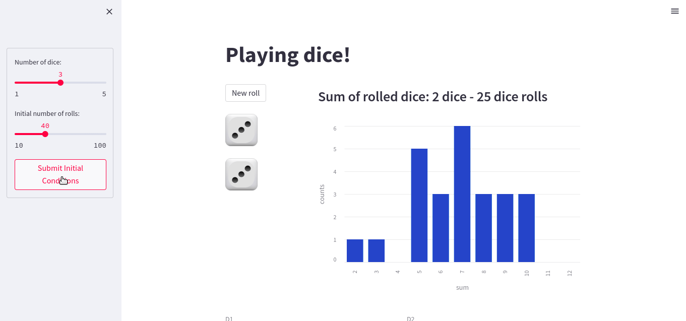

# Project Dice 🎲

This is a simple project to view the distribution of the sum of rolled 6-sided dice.

The idea is to "see" how the distribtuion shape evolves in a web app.

The script [gen-data.py](gen-data.py) is a testing script were a number `ND` of dice are rolled `N` times and their sum is stored and plotted in a simple histogram.

We use [Streamlit](https://streamlit.io/) to build an app in which the user can choose the value of `ND` (from 1 to 5) and the (inital) value for `N` and see the distribution of the sum of rolled dice. The user can simulate new dice rolls and see the change in the distribution dynamically.

*Example usage of dash app.*

The script for the app can be found inside the **st-app** folder [here](st-app/app.py).
